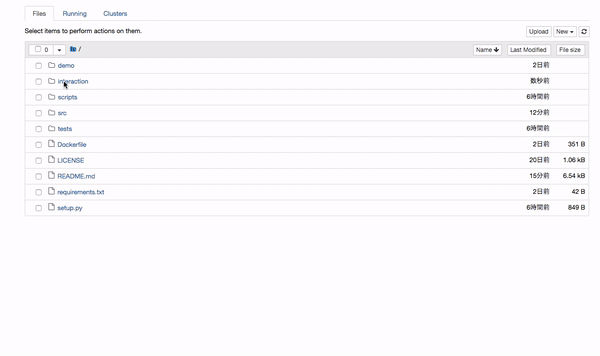

# floweaver-docker

## Description



This library (floweaver-path) is an extension of the [floweaver](https://sankeyview.readthedocs.io/en/latest/) to handle the visualization of paths that pass through a selected node.

We focus on the visualization of longitudinal data.

The idea of our visualization is based on [pathSankey](https://bl.ocks.org/jeinarsson/e37aa55c3b0e11ae6fa1), that is an extension of [d3-sankey](https://github.com/d3/d3-sankey).

The color of paths that pass through a selected node is yellow-green (highlighted), and that of other paths is gray.

You can interactively select a node by using dropdowns in jupyter notebook.

We have two technical contributions to the field of visualization using Sankey diagrams.

One is to extend the layer number:
- Ordinary Sankey diagrams can only visualize paths between 2 layers.
- pathSankey can only visualize paths between 3 layers.
- We can visualize the comparison of paths between two layers before and after (up to 5 layers).

The other is to create a notebook that can interact with users. We integrate several functions of ipywidgets into floweaver.

## Requirement

- docker (installs two libraries: floweaver, ipysankeywidget)
- input file

## Setup

### build

`scripts/build`

### run notebook

`scripts/run-notebooks`

Run docker, and connect `interaction` to `work`.

Data and notebooks are shared between a docker image and your local system.

If you deleted the template notebook (`template.ipynb`) or the template data (`data/template_data.csv`) by mistake, you can restore it by shutting down the kernel and running notebooks again (`scripts/run-notebooks`).

### use notebooks in browser

Open a new browser tab and type `localhost: 10001` in the URL.

Copy and paste a token to use notebooks. The token you can use is displayed in your terminal as follows:

`http://(<id> or 127.0.0.1):8888/?token=<token>`


## Usage

### prepare data in the data directory

You can use the jupyter notebook to upload your local file in the `data` directory. You can also directly put your local file in the data directory.

We focus on longitudinal data. The format of your file should be as follows:
```
   index  date  value1  value2
0        1      2016/04/01   1   3
1        2      2016/10/01   3   2
2        1      2016/04/01   4   1
```

- index: This variable is handled as user id.
- date: This variable is handled as the date and visualized in the x-axis. Data should not be duplicated with respect to a pair of (index, date).
- value[n] (): These variables are handled as target variables. One of those variables is visualized in the y-axis.

The name of each variable can be changed between files. You can select which variable to use interactively.

Note that we support three types of file extensions: `.csv`, `.xlsx` and `.pickle`
Please check the details of the data by loading `data/template_data.csv`.

### launch a working notebook

The template notebook (`template.ipynb`) should not be changed.
I recommend you to duplicate the template notebook and work on the duplicated notebook.


### select a target node

We prepare 7 dropdowns for users to interact with floweaver.
- multiple display?: whether this library displays multiple images or not.
- file path: data to be analyzed.
- index column: column name that contains id information (e.g., user_id).
- date column: column name that contains date information (visualized in the x-axis).
- target varible: column name that you want to analyze (visualized in the y-axis).
- target date: value name that you want to select as the value of your target date.
- target value: value name that you want to select as the value of your target variable.

The dependence between the dropdowns is updated as soon as you select each value.


## Author

- [@fullflu](https://github.com/fullflu) proposed to create this library and prepared basic scripts.
- [@adamist](https://github.com/adamist) created `Dockerfile`, `build` and `run-notebook` scripts.


## Contributors

Please feel free to create issues or to contribute to floweaver-path!
It would be useful to contribute to the original [floweaver](https://github.com/ricklupton/floweaver/blob/master/CONTRIBUTING.md) library.

## License

[MIT](https://github.com/fullflu/floweaver-path/blob/master/LICENSE)


## Structure

<!-- tree -L 2 -->
```
├── Dockerfile
├── LICENSE
├── README.md
├── demo
│   └── floweaver_path_demo.gif
├── interaction
│   ├── data
│   └── template.ipynb
├── requirements.txt
├── scripts
│   ├── build
│   └── run-notebook
└── src
    ├── __init__.py
    ├── lib
    ├── main.py
    └── template
```